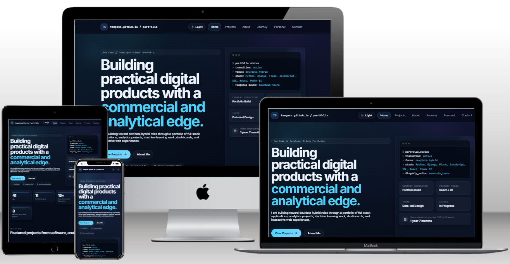

# 🚀 Tom Goss — Full Stack & Data Portfolio


---



---

## 🌐 Live Portfolio

🔗 **Live Site:** [tomgoss.github.io](https://tgoss1984.github.io/tomgoss.github.io/)  
📂 **Repository:** [github.com/TGOSS1984/tomgoss.github.io](https://github.com/TGOSS1984/tomgoss.github.io)

---

## 📖 Overview

This portfolio is designed as an **interactive experience**, not just a project list.

It combines:
- ⚡ A cinematic **intro journey** representing my progression into tech
- 📊 **Data-driven storytelling** through projects and metrics
- 🧩 A curated **full-stack + analytics + interactive project suite**
- 🎨 A consistent **dark/light theme with animated components and a custom design system**

The goal is to demonstrate both **technical ability** and **how I think about building real-world solutions**.

---

## 🧭 Site Structure

### 🎬 Intro Experience
A multi-scene animated introduction built with **Framer Motion**, visualising skill progression and a "journey up the mountain" concept, with custom loading states and transitions.

### 🧑‍💻 Hero Section
Clear positioning as a **Full Stack Developer & Data Analyst**, with an immediate call-to-action into projects.

### 📊 Stats Strip
Animated KPI-style counters highlighting projects, technologies used, and real-world scale — designed to mirror business dashboards and BI reporting.

### 🗺️ Journey Timeline
A visual timeline showing the transition from a commercial and data background into development, with progressive skill growth across tools and technologies.

### 🙋 About
A profile section covering background, strengths, and primary tech stack — combining a personal narrative with a rotating 3D globe showing live location and local time.

### 🏔️ Personal
A "beyond the build" section covering the personal interests and environments that influence the work — mountain environments, scrambling, and the outdoors that feed into the project themes throughout the portfolio.

### 📬 Contact
A contact form for direct outreach, alongside links to GitHub and LinkedIn. PDF downloads for CV & full stack qualification can be found here.

---

## 🧩 Featured Projects

### 🏔️ UK Summit Guides
A full stack mountain guiding platform pairing a React frontend with a Django REST API. Features route exploration with interactive GPX mapping, live weather integration, Stripe-powered bookings, and authenticated accounts behind a responsive, editorial-style UI.

🔗 [Live Demo](https://uk-summit-guides.vercel.app/) · 📂 [GitHub](https://github.com/TGOSS1984/uk-summit-guides)

---

### 📊 Ascent Analytics
A Power BI business intelligence platform built as a companion to UK Summit Guides — a full synthetic-data pipeline (Python, pandas, Faker, pandera) feeding a SQLite star-schema warehouse and 10 fully-built Power BI dashboards, with DAX-driven KPIs, YoY comparatives, and a written insight report.

📂 [GitHub](https://github.com/TGOSS1984/ascent-analytics) *(code only — no public deployment)*

---

### ⛰️ SummitLog UK
A personal mountain tracking application for UK hillwalkers to log, visualise, and reflect on time in the mountains — covering Wainwrights, Munros, and Nuttalls with over 800 summits sourced from the DOBIH dataset. Built with React + Vite and a Django REST Framework API, with a custom design system, animated SVG mountain cards, Leaflet mapping, and a full achievement system.

🔗 [Live Demo](https://summitlog-uk.vercel.app/) · 📂 [GitHub](https://github.com/TGOSS1984/summitlog-uk)

---

### 📈 Winter Mountain Tours Demand Predictor
A predictive analytics app using a Scikit-learn forecasting model to predict seasonal demand for guided mountain tours. Built with Pandas for data processing and served through an interactive Streamlit interface, designed to support real operational planning decisions.

🔗 [Live Demo](https://winter-tour-predictor-ce48d589f61d.herokuapp.com/) · 📂 [GitHub](https://github.com/TGOSS1984/winter-mountain-tours-demand-predictor)

---

> View all 13 projects — including interactive builds, e-commerce, BI dashboards, CLI tools, and more — on the [live portfolio](https://tgoss1984.github.io/tomgoss.github.io/).

---

## ⚙️ Tech Stack

### Frontend
- React (Vite), JavaScript (ES6+), TypeScript
- HTML5 / CSS3, Framer Motion

### Backend
- Python, Django, Django REST Framework, Flask

### Data & Machine Learning
- pandas, NumPy, scikit-learn, Streamlit

### Analytics & BI
- Power BI, DAX, Power Query, SQL (SQLite / PostgreSQL)

### Tools & Deployment
- Git & GitHub, GitHub Pages, Vercel, Heroku
- Cloudflare R2, Leaflet, Stripe

---

## 🎯 Key Features

- 🎬 Custom animated intro experience
- 💡 Click-to-expand project lightbox with image gallery and full project details
- 📊 KPI-style data visualisation UI
- ⚡ Smooth page transitions and route loading
- 🎨 Dark/light theme with CSS design tokens and animated background effects
- 📱 Fully responsive design
- 🧩 Modular, scalable React component structure

---

## 🛠️ Local Development

```bash
git clone https://github.com/TGOSS1984/tomgoss.github.io
cd tomgoss.github.io
npm install
npm run dev
```

---

## 🚀 Future Enhancements

- Add deeper project case studies (problem → solution → impact)
- Expand interactive data visualisations
- Add analytics tracking to portfolio usage

---

## 📬 Contact

- **LinkedIn:** [linkedin.com/in/your-profile](https://linkedin.com/in/your-profile)
- **GitHub:** [github.com/TGOSS1984](https://github.com/TGOSS1984)

---

## ⭐ Final Note

This portfolio reflects a focus on building clean, scalable applications and solving real-world business problems by combining development with data analytics. If you're hiring for roles across **Full Stack, Data, or Hybrid positions**, feel free to connect.